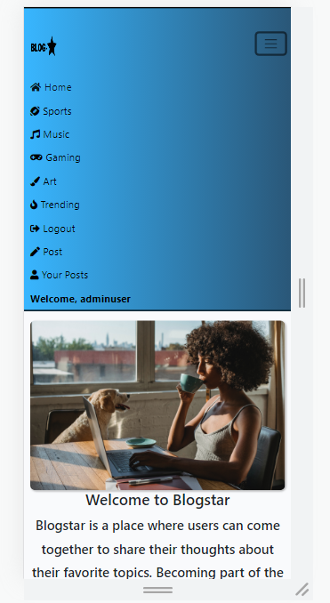

## BlogStar

Blogstar is a blog website where users can easily sign up, create personalized accounts, and express their passions through engaging posts in a diverse range of categories. Whether you're an avid sports enthusiast, a music connoisseur, a dedicated gamer, or an art aficionado, Blogstar offers the perfect platform to share your unique perspectives and connect with like-minded individuals.

On Blogstar, the user can explore a wide range of topics, read insightful posts from fellow users, and leave comments to join the conversation. The user can show appreciation for posts by liking them and share captivating content on popular social media platforms like Facebook and Twitter effortlessly.

Live link to [BlogStar] (Add heroku link once website is fully deployed)

## Table of contents
  * [BlogStar](#BlogStar)
  * [UX](#ux)
    + [Strategy](#strategy)
    + [Scope](#scope-hr-)
    + [Structure](#structure-hr-)
    + [Skeleton](#skeleton-hr-)
    + [Surface](#surface-hr-)
      - [Color Scheme](#color-scheme)
      - [Fonts](#fonts)
      - [Visual Effects](#visual-effects)
  * [Agile Methodology](#agile-methodology)
  * [Features](#features)
    + [Existing Features](#existing-features)
      - [Create bookings](#create-bookings)
      - [Reviews](#reviews)
      - [Menu](#menu)
      - [Profiles](#profiles)
      - [Staff bookings management](#staff-bookings-management)
    + [Future Feature Considerations](#future-feature-considerations)
  * [Responsive Layout and Design](#responsive-layout-and-design)
  * [Tools Used](#tools-used)
    + [Python packages](#python-packages)
  * [Testing](#testing)
  * [Deployment](#deployment)
    + [Deploy on heroku](#deploy-on-heroku)
    + [FORK THE REPOSITORY](#fork-the-repository)
    + [CLONE THE REPOSITORY](#clone-the-repository)
  * [Credits](#credits)
    + [Content](#content)
    + [Media](#media)
    + [Code](#code)
  * [Acknowledgements](#acknowledgements)

## UX
This site was created respecting the Five Planes Of Website Design: 
### Strategy

**User Stories:**  

| EPIC                                | ID | User Story                                                                                                  |
| :---------------------------------- | -- | ----------------------------------------------------------------------------------------------------------- |
| **CONTENT AND NAVIGATION**          |    |                                                                                                             |
|                                     | 1A | As a user, I want the blog website to have a clear and intuitive navigation menu                           |
|                                     | 1B | As a user, I want to find relevant and captivating content about various topics shared by other bloggers   |
|                                     | 1C | As a user, I want the website's design to be aesthetically pleasing and align with the blog's theme        |
| **USER REGISTRATION/AUTHENTICATION** |    |                                                                                                             |
|                                     | 2A | As a user, I want a seamless sign-up process to create my personalized account on the blog website         |
|                                     | 2B | As a user, I want to be able to log in to the website using my email and password securely                |
|                                     | 2C | As a user, I want the option to log out from my account easily whenever I wish to                          |
| **BLOG POSTS**                      |    |                                                                                                             |
|                                     | 3A | As a logged-in user, I want to be able to delete or create my blog posts, allowing me to share my thoughts and experiences |
|                                     | 3B | As a user, I want to read engaging blog posts on diverse topics, inspiring me to explore new interests    |
|                                     | 3C | As a user, I want to be able to share images with my posts.                                                |
| **INTERACTION**                     |    |                                                                                                             |
|                                     | 4A | As a logged-in user, I want the ability to like blog posts that resonate with me                           |
|                                     | 4B | As a logged-in user, I want to leave comments on blog posts, fostering a sense of community and allowing me to engage with other bloggers |
|                                     | 4C | As a user, I want the option to share captivating blog posts on social media platforms like Facebook and Twitter, spreading inspiration to a wider audience |
| **USER PROFILE**                    |    |                                                                                                             |
|                                     | 5A | As a logged-in user, I want to access a personalized profile page that displays my published blog posts    |
|                                     | 5B | As a logged-in user, I want to have my account name displayed on the post                                  |
| **DISCOVERY**                       |    |                                                                                                             |
|                                     | 6A | As a user, I want to discover popular blog posts to stay updated with the latest discussions              |
|                                     | 6B | As a user, I want to explore blog posts categorized by topics like sports, music, gaming, or art          |

**Project Goal:** 
Create a blog website similar to reddit or tumblr with 4 categories where users can share like and comment on posts.

**Project Objectives:**  
* To create a website with a simple and intuitive User Experience;
* To encourage active user participation through account creation, blog posting, liking, commenting, and sharing;
* To provide a wide range of categories for users to explore and share their passions;
* To implement a secure signup process to protect user accounts;
* To make the website available and functional on every device.  

### Scope

**Simple and intuitive User Experience** 
* Ensure the navigation menu is visible and functional at every step;
* Ensure every page has a suggestive name that fits its content;
* Ensure the users will get visual feedback when navigating through pages;
* Ensure the design is simple and does not confuse the user;

**User engagement** 
* Implement a seamless and user-friendly account creation process to allow users to sign up easily and become active members of the community;
* Integrate social features such as liking, commenting, and sharing on blog posts;
* Provide users with a user-friendly blog posting interface;

**Diverse categories** 
 * Create a diverse set of categories, including sports, music, gaming, and art to cater to various user intrests;
 * Create concise and engaging descriptions for each category, giving users insights into the type of content they can expect to find, thereby encouraging them to explore and contribute;

**Signup process**
* Implement Cross-Site Request Forgery (CSRF) protection mechanisms to safeguard against unauthorized actions initiated by malicious websites or attackers pretending to be legitimate users;
* Enforce password complexity rules, such as password is too similar to the username;

**Responsiveness** 
* Create a responsive design for desktop, tablet and mobile devices.  

### Structure

The website's structure is divided into eight pages. However, when the user is signed in, the structure dynamically changes to include additional features, such as "Post" and "Your Posts." This allows the signed-in user to create new posts and delete their own posts, enhancing their interaction and experience on the platform.

-**Register/Login** pages give the user the possibility to create an account and authenticate for accessing different features; 
-**Logout** page helps user exit their current account; 
-The **Home** page is visible for all users logged in/out and includes the website main image also known as hero image and a description of what the website hopes to accomplish for the user; 
-The **Sports** page displays sports related posts made by the users; 
-The **Art** page displays art related posts made by the users; 
-The **Gaming** page displays gaming related posts made by the users; 
-The **Music** page displays music related posts made by the users; 
-The **Post** page allows the logged in user to create a post by introducing title image(not mandatory) content and relevant category for the post; 
-The **Your Posts** page allows  the logged in user to see all the posts they have created and to delete them if they so desire; 
-**Trending** page allows the user to view the most liked posts based on the amount of likes. 

* FLOWCHARTS
The Flowchart for my program was created using <b>LucidChart</b> and it visually represents how the system works. 
  

### Skeleton

**Wireframes** 
In the design phase of the website I used Balsamiq to create wireframes in order to get an idea how the site will look. 

**Database** 
The project uses the PostgreSQL for storing the data and cloudinary for storing images 
below is a relational database model that I created before making the Post model for my website.

### Surface

#### Color Scheme
Colors primarly used were blue gradient black,white, gray and red. I found that these colors did not cause eye strain after testing some others 
* List of main and secondary colors used for buttons and to design scrollbar 
 
 
 
 
                      
  
  

#### Fonts
The fonts I used for this site were imported from [Google Fonts](https://fonts.google.com/): 

## Agile Methodology
In order to complete this project I have used the Agile Methodology. This involves breaking down the project into smaller tasks called User Stories. These user stories were added using githubs Issues functionality. Each user story was made into an issue and added to the projects kanban board. After each user story was coded into the websites functionality I would move the issue from "To Do" Column into "In Progress" and eventually into "Done" column depending what stage of development it was.
The live board can be accessed [here](https://github.com/users/Gabriel5638/projects/6/views/1).
 
 

## Features
### Existing Features

#### Create Post
Every user that is logged in can acess the create post feature, this feature allows the user to create their desired post by filling in the sections.  
* Title,Content and category are mandatory fields that the user who wants to create a post must fill in.

  

* Image, user can choose a desired image to feature on the post or they can leave it blank and a placeholder image will be uploaded instead. 

  

### Comments
* The comment section displays a curated list of comments that the user can read through and post their own once the admin has verified the comments as not insulting, or offensive in any other way.

  

### Trending

* The trending section allows the users to view what posts are popular based on the number of likes that the post receives.

  

#### Profiles

* The user can create a personalized profile that will display their username at the top of the page once they log in.

  
  

* The your post section allows the user to delete their posts if they want.

  

### Categories
* The user can choose from multiple categories to post in sports,gaming music and art.

  

### Icons
* Posts can be liked by pressing the heart icon this also keeps track of what posts are trending by the number of likes.
* The share button shows all the social media platforms the post can be shared to.
* The number of comments is displayed beside the comment icon.

  

### Scrollbar
* Custom scrollbar that lights up red when clicked or hovered over, created using css. 

  

### Responsive Layout and Design

* Navbar can be toggled  on smaller screens for better browsing on phones and tablets.

  

**Tested devices:**

    - Moto G4 
    - iPhone SE 
    - iPhone XR 
    - iPhone 11 
    - iPhone 13
    - iPhone 5/SE 
    - iPhone 6/7/8 
    - Ipad
    - Ipad Air 
    - Ipad Mini
    - Ipad Pro 
    - Pixel 5 
    - Surface Duo 
    - Surface Pro 7 
    - Nest Hub 
    - Nest Hub Max
    - Samsung Galaxy S20 Ultra 
    - Samsung Galaxy S8 
    - Galaxy Note 2 
    - Galaxy Tab S4
    - Dell inspiron

## Tools Used
[GitHub](https://github.com/) - used for hosting the source code of the program 
[Heroku](https://dashboard.heroku.com/) - used for deploying the project 
[Balsamiq](https://balsamiq.com/wireframes/) - for creating the wireframes 
[LucidChart](https://www.lucidchart.com/) - used for creating the Flowchart and Database relational schema 
[Favicon.io](https://favicon.io/) - used for generating the website favicon 
[Diffchecker](https://www.diffchecker.com/) - used for comparing the code 
[Grammarly](https://app.grammarly.com/) - for correcting text content 
[Font Awesome](https://fontawesome.com/) - for creating atractive UX with icons 
[Bootstrap5](https://getbootstrap.com/) - for adding predifined styled elements and creating responsiveness 
[Google Fonts](https://fonts.google.com/) - for typography 
[JsHint](https://jshint.com/) - used for validating the javascript code 
[PEP8 Validator](http://pep8online.com/) - used for validating the python code 
[HTML - W3C HTML Validator](https://validator.w3.org/#validate_by_uri+with_options) - used for validating the HTML 
[CSS - Jigsaw CSS Validator](https://jigsaw.w3.org/css-validator/#validate_by_uri) - used for validating the CSS 
[Chrome Del Tools](https://developer.chrome.com/docs/devtools/) - for debugging the project 
[Cloudinary](https://cloudinary.com/) - for storing images 
[LightHouse](https://developer.chrome.com/docs/lighthouse/overview/) - for testing performance 
[ElephantSQL](https://www.elephantsql.com/) - for storing data  

### Python packages

* asgiref
* black
* click
* cloudinary
* dj-database-url
* dj3-cloudinary-storage
* Django
* django-allauth
* django-crispy-forms
* django-summernote
* gunicorn
* oauthlib
* pathspec
* psycopg2
* PyJWT
* python3-openid
* pytz
* requests-oauthlib
* sqlparse
* urllib3

## Testing
The testing documentation can be found at [TESTING.MD](TESTING.MD)

2. Setting up Heroku

    * Go to the Heroku website (https://www.heroku.com/) 
    * Login to Heroku and choose *Create App* 
    * Click *New* and *Create a new app*
    * Choose a name and select your location
    * Go to the *Resources* tab 
    * From the Resources list select *Heroku Postgres*
    * Navigate to the *Deploy* tab
    * Click on *Connect to Github* and search for your repository
    * Navigate to the *Settings* tab
    * Reveal Config Vars and add your Cloudinary, Database URL (from Heroku-Postgres) and Secret key.    

3. Deployment on Heroku

    * Go to the Deploy tab.
    * Choose the main branch for deploying and enable automatic deployment 
    * Select manual deploy for building the App 
    
### Fork the repository
For creating a copy of the repository on your account and change it without affecting the original project, use<b>Fork</b> directly from GitHub:
- On [My Repository Page](https://github.com/Gabriel5638?tab=repositories), press <i>Fork</i> in the top right of the page
- A forked version of my project will appear in your repository  

### Clone the repository
For creating a clone of the repository on your local machine, use<b>Clone</b>:
- On [My Repository Page](https://github.com/Gabriel5638/blog-website), click the <i>Code</i> green button, right above the code window
- Chose from <i>HTTPS, SSH and GitClub CLI</i> format and copy (preferably <i>HTTPS</i>)
- In your <i>IDE</i> open <i>Git Bash</i>
- Enter the command <code>git clone</code> followed by the copied URL
- Your clone was created

## Credits

## Acknowledgements